# Antibody Database Schema

This database is designed to support an automated, evidence-tracked antibody data curation workflow. Its primary function is to store structured information extracted from WHO INN documents, web scrapers, clinical trial registries, literature repositories, and LLM-assisted extraction pipelines. The database is intended to improve the Thera-SAbDab resource by making data ingestion, updating, provenance tracking, manual review, and downstream analysis more systematic. This document describes the proposed SQLite-compatible relational schema, including how each table contributes to storing antibody identity, molecular structure, sequence data, IMGT-based annotations, clinical use, clinical trial results, literature links, and evidence/change tracking.

## Schema diagram

The diagram below is a visualisation of the database architecture. Each component of the database will be described in the following section.

```mermaid
erDiagram

  ANTIBODY {
    int antibody_id
    string inn_name
    string canonical_name
    int year_proposed
    string mode_of_action_summary
    string structural_summary
    string structural_identity_note
    string created_at
    string updated_at
  }

  ANTIBODY_IDENTIFIER {
    int identifier_id
    int antibody_id
    string identifier_scheme
    string identifier_value
    string identifier_url
    boolean is_primary_for_scheme
    string source_note
  }

  ANTIBODY_NAME {
    int name_id
    int antibody_id
    string name
    string name_type
    string source_note
  }

  ANTIBODY_FORMAT {
    int format_id
    string format_name
    string format_category
    boolean is_multispecific
    boolean is_fusion
    string description
  }

  ANTIBODY_FORMAT_ASSIGNMENT {
    int assignment_id
    int antibody_id
    int format_id
    string evidence_text
    string source_note
  }

  BIOCHEMICAL_TARGET {
    int target_id
    string target_name
    string target_type
    string gene_symbol
    string uniprot_id
    string description
  }

  ANTIBODY_TARGET {
    int antibody_target_id
    int antibody_id
    int target_id
    string target_role
    string evidence_text
  }

  GENETIC_SOURCE {
    int genetic_source_id
    string source_name
    string species
    string engineering_type
    string description
  }

  ANTIBODY_GENETIC_SOURCE {
    int antibody_genetic_source_id
    int antibody_id
    int genetic_source_id
    string evidence_text
    string source_note
  }

  STRUCTURAL_FEATURE {
    int structural_feature_id
    int antibody_id
    string feature_type
    string feature_name
    string feature_value
    string evidence_text
    string source_note
  }

  ANTIBODY_COMPONENT {
    int component_id
    int antibody_id
    string component_name
    string component_type
    int component_order
    string role_description
    int target_id
    string notes
  }

  CHAIN {
    int chain_id
    int component_id
    string chain_type
    string chain_label
    string chain_role
    string isotype
    string notes
  }

  CHAIN_SEQUENCE {
    int sequence_id
    int chain_id
    string sequence_type
    string amino_acid_sequence
    int start_residue
    int end_residue
    string numbering_scheme
    string source_note
  }

  CHAIN_DOMAIN {
    int domain_id
    int chain_id
    int sequence_id
    string domain_type
    string domain_label
    int start_residue
    int end_residue
    string amino_acid_sequence
    string numbering_scheme
    string notes
  }

  IMGT_MOLECULAR_ANNOTATION {
    int imgt_annotation_id
    int antibody_id
    string imgt_molecular_key
    string imgt_annotation_status
    string imgt_annotation_source
    string notes
  }

  IMGT_CHAIN_ANNOTATION {
    int imgt_chain_annotation_id
    int chain_id
    string imgt_chain_label
    string imgt_chain_type
    string v_gene
    string d_gene
    string j_gene
    string c_gene
    string allele_calls
    string numbering_scheme
    string annotation_confidence
  }

  IMGT_DOMAIN_ANNOTATION {
    int imgt_domain_annotation_id
    int domain_id
    string domain_type
    string imgt_start_position
    string imgt_end_position
    string cdr1_sequence
    string cdr2_sequence
    string cdr3_sequence
    string framework_1_sequence
    string framework_2_sequence
    string framework_3_sequence
    string framework_4_sequence
  }

  SEQUENCE_IDENTITY_MATCH {
    int identity_match_id
    int antibody_id
    int matched_antibody_id
    string comparison_region
    float identity_percentage
    string identity_bin
    string method
    string evidence_text
  }

  MANUFACTURER {
    int manufacturer_id
    string manufacturer_name
    string country
    string website
    string notes
  }

  ANTIBODY_MANUFACTURER {
    int antibody_manufacturer_id
    int antibody_id
    int manufacturer_id
    string manufacturer_role
    boolean is_current
    string start_date
    string end_date
    string source_note
  }

  CONDITION {
    int condition_id
    string condition_name
    string ontology_id
    string description
  }

  USAGE_STATUS {
    int usage_status_id
    string status_name
    string description
  }

  ANTIBODY_USAGE {
    int antibody_usage_id
    int antibody_id
    int condition_id
    int usage_status_id
    string region
    string approval_date
    string discontinuation_date
    string evidence_text
    string source_note
  }

  CLINICAL_TRIAL {
    int clinical_trial_id
    int antibody_id
    string registry
    string registry_trial_id
    string trial_title
    string phase
    string trial_status
    string start_date
    string completion_date
    string sponsor
    string source_url
    string notes
  }

  CLINICAL_TRIAL_CONDITION {
    int trial_condition_id
    int clinical_trial_id
    int condition_id
  }

  TRIAL_RESULT {
    int trial_result_id
    int clinical_trial_id
    string result_category
    string result_summary
    string result_date
    string source_url
    string confidence_score
    string notes
  }

  TRIAL_ADA_RESULT {
    int ada_result_id
    int trial_result_id
    string ada_detected
    string ada_metric_name
    float ada_value_numeric
    string ada_value_text
    string units
    string assay_type
    string assay_description
    string timepoint
    string interpretation
  }

  TRIAL_SAFETY_EVENT {
    int safety_event_id
    int trial_result_id
    string event_name
    string event_type
    string severity_grade
    float frequency_numeric
    string frequency_text
    string units
    boolean serious_event
    string notes
  }

  TRIAL_QUALITATIVE_RESULT {
    int qualitative_result_id
    int trial_result_id
    string topic
    string qualitative_text
    string extracted_symptoms
    string interpretation
    string notes
  }

  LITERATURE_SOURCE {
    int literature_source_id
    string source_name
    string source_type
    string base_url
    string notes
  }

  LITERATURE_REFERENCE {
    int literature_reference_id
    int antibody_id
    int literature_source_id
    string title
    string authors
    string journal
    int publication_year
    string doi
    string pmid
    string url
    string abstract
    string relevance_reason
    float relevance_score
    string notes
  }

  DATA_SOURCE {
    int data_source_id
    string source_type
    string source_name
    string url
    string citation
    string accessed_at
    string version_tag
    string raw_payload_path
    string notes
  }

  INGESTION_RUN {
    int run_id
    string run_type
    string pipeline_stage
    string tool_name
    string tool_version
    string prompt_version
    string model_name
    string started_at
    string finished_at
    string notes
  }

  FIELD_EVIDENCE {
    int evidence_id
    int antibody_id
    int data_source_id
    int run_id
    string table_name
    string record_id
    string field_name
    string extracted_value
    string evidence_text
    string confidence_score
    string review_status
    string reviewer_note
  }

  CHANGE_LOG {
    int change_id
    int antibody_id
    int data_source_id
    int run_id
    string table_name
    string record_id
    string field_name
    string old_value
    string new_value
    string changed_at
    string change_reason
  }

  ANTIBODY ||--o{ ANTIBODY_IDENTIFIER : has_identifier
  ANTIBODY ||--o{ ANTIBODY_NAME : has_name
  ANTIBODY ||--o{ ANTIBODY_FORMAT_ASSIGNMENT : has_format
  ANTIBODY_FORMAT ||--o{ ANTIBODY_FORMAT_ASSIGNMENT : assigned_to

  ANTIBODY ||--o{ ANTIBODY_TARGET : has_target
  BIOCHEMICAL_TARGET ||--o{ ANTIBODY_TARGET : targeted_by

  ANTIBODY ||--o{ ANTIBODY_GENETIC_SOURCE : has_genetic_source
  GENETIC_SOURCE ||--o{ ANTIBODY_GENETIC_SOURCE : describes_source

  ANTIBODY ||--o{ STRUCTURAL_FEATURE : has_structural_feature
  ANTIBODY ||--o{ ANTIBODY_COMPONENT : has_component
  BIOCHEMICAL_TARGET ||--o{ ANTIBODY_COMPONENT : component_targets

  ANTIBODY_COMPONENT ||--o{ CHAIN : contains_chain
  CHAIN ||--o{ CHAIN_SEQUENCE : has_sequence
  CHAIN ||--o{ CHAIN_DOMAIN : has_domain
  CHAIN_SEQUENCE ||--o{ CHAIN_DOMAIN : domain_from_sequence

  ANTIBODY ||--o{ IMGT_MOLECULAR_ANNOTATION : has_imgt_annotation
  CHAIN ||--o{ IMGT_CHAIN_ANNOTATION : has_imgt_chain_annotation
  CHAIN_DOMAIN ||--o{ IMGT_DOMAIN_ANNOTATION : has_imgt_domain_annotation

  ANTIBODY ||--o{ SEQUENCE_IDENTITY_MATCH : query_antibody
  ANTIBODY ||--o{ SEQUENCE_IDENTITY_MATCH : matched_antibody

  ANTIBODY ||--o{ ANTIBODY_MANUFACTURER : manufactured_by
  MANUFACTURER ||--o{ ANTIBODY_MANUFACTURER : manufactures

  ANTIBODY ||--o{ ANTIBODY_USAGE : has_usage
  CONDITION ||--o{ ANTIBODY_USAGE : usage_condition
  USAGE_STATUS ||--o{ ANTIBODY_USAGE : usage_status

  ANTIBODY ||--o{ CLINICAL_TRIAL : studied_in
  CLINICAL_TRIAL ||--o{ CLINICAL_TRIAL_CONDITION : studies_condition
  CONDITION ||--o{ CLINICAL_TRIAL_CONDITION : trial_condition

  CLINICAL_TRIAL ||--o{ TRIAL_RESULT : has_result
  TRIAL_RESULT ||--o{ TRIAL_ADA_RESULT : has_ada_result
  TRIAL_RESULT ||--o{ TRIAL_SAFETY_EVENT : has_safety_event
  TRIAL_RESULT ||--o{ TRIAL_QUALITATIVE_RESULT : has_qualitative_result

  ANTIBODY ||--o{ LITERATURE_REFERENCE : has_literature
  LITERATURE_SOURCE ||--o{ LITERATURE_REFERENCE : indexed_by

  DATA_SOURCE ||--o{ FIELD_EVIDENCE : supports
  INGESTION_RUN ||--o{ FIELD_EVIDENCE : generated
  ANTIBODY ||--o{ FIELD_EVIDENCE : has_evidence

  DATA_SOURCE ||--o{ CHANGE_LOG : source_of_change
  INGESTION_RUN ||--o{ CHANGE_LOG : change_run
  ANTIBODY ||--o{ CHANGE_LOG : has_change
```



## Design principles

### Use an internal database key and a public antibody identifier

The database uses `antibody_id` as the internal primary key for joins. This is efficient, stable, and robust to name normalization or future corrections.

The `inn_name` should be unique and should remain the main public-facing identifier because it is the name that curators, users, and WHO INN-derived workflows will most often use.

Recommended constraints:

```sql
UNIQUE (inn_name)
```

### Store IMGT identifiers as an identity and annotation layer

IMGT nomenclature should not replace the internal database key. Instead, IMGT-compatible information should be stored in dedicated identifier and annotation tables:

- `ANTIBODY_IDENTIFIER`
- `IMGT_MOLECULAR_ANNOTATION`
- `IMGT_CHAIN_ANNOTATION`
- `IMGT_DOMAIN_ANNOTATION`

This allows the database to store official IMGT/mAb-DB links where available and generated IMGT-derived molecular keys where sequence/domain annotation is available.

### Avoid list-like fields in the core antibody table

Properties such as other names, targets, manufacturers, clinical indications, sequences, literature references, and clinical trial results can occur multiple times per antibody. These should be stored as separate related tables rather than comma-separated strings or JSON blobs.

### Separate extracted evidence from curated truth

LLM- and scraper-derived values should be traceable. The `FIELD_EVIDENCE` table allows candidate extracted values to be stored with evidence snippets, source URLs, confidence scores, and manual review status.

The curated tables can then be updated from reviewed evidence.

## Core antibody identity

### `ANTIBODY`

Stores one row per antibody or antibody-like therapeutic entity.

This is the central table to which most other tables connect.

Main fields:

| Field | Purpose |
|---|---|
| `antibody_id` | Internal stable integer identifier used for joins. |
| `inn_name` | Unique WHO INN name. |
| `canonical_name` | Cleaned display name, usually same as INN. |
| `year_proposed` | Year proposed in the WHO INN list. |
| `mode_of_action_summary` | Short text summary of mechanism or mode of action. |
| `structural_summary` | Structural description parsed from the WHO INN source. |
| `structural_identity_note` | Summary text for structural identity or similarity information. |
| `created_at` | Record creation timestamp. |
| `updated_at` | Last update timestamp. |

### `ANTIBODY_IDENTIFIER`

Stores identifiers from external systems and generated identifier schemes.

Examples include:

- INN
- IMGT/mAb-DB identifier or URL
- DrugBank ID
- ChEMBL ID
- PubMed-linked concept identifiers
- internally generated IMGT-derived molecular keys

Main fields:

| Field | Purpose |
|---|---|
| `identifier_scheme` | Identifier namespace, such as `INN`, `IMGT_MAB_DB`, `DRUGBANK`, `CHEMBL`, or `INTERNAL_IMGT_KEY`. |
| `identifier_value` | Identifier value. |
| `identifier_url` | Link to the identifier record, if available. |
| `is_primary_for_scheme` | Marks the preferred identifier for a specific scheme. |
| `source_note` | Free-text provenance note. |

This table makes the database extensible without adding a new column for every external database.

### `ANTIBODY_NAME`

Stores synonyms, brand names, development names, and other aliases.

Useful `name_type` values:

| Value | Meaning |
|---|---|
| `inn` | WHO INN name. |
| `brand` | Commercial or brand name. |
| `development_code` | Internal or clinical development code. |
| `synonym` | General alias. |
| `descriptive` | Descriptive name, such as anti-target antibody. |

## Antibody format, target, and genetic source

### `ANTIBODY_FORMAT`

Controlled vocabulary for antibody format.

Examples:

| Format | Category |
|---|---|
| IgG1 monoclonal antibody | full_length_mab |
| Fab fragment | fragment |
| scFv | fragment |
| bispecific IgG-like antibody | multispecific |
| antibody-cytokine fusion | fusion |
| antibody-drug conjugate | conjugate |

The fields `is_multispecific` and `is_fusion` make it easier to identify complex molecules programmatically.

### `ANTIBODY_FORMAT_ASSIGNMENT`

Links an antibody to one or more formats.

This is useful because an antibody can have layered structural descriptions, for example:

- bispecific
- Fc-containing
- IgG-like
- fusion protein

Each assignment can store evidence text from the WHO INN list or a curated source.

### `BIOCHEMICAL_TARGET`

Stores normalized target entities.

Examples:

| Target | Gene symbol |
|---|---|
| tumour necrosis factor alpha | TNF |
| interleukin-6 receptor | IL6R |
| HER2 receptor | ERBB2 |
| programmed cell death protein 1 | PDCD1 |

This table supports optional annotation using gene symbols and UniProt IDs.

### `ANTIBODY_TARGET`

Links antibodies to biochemical targets.

This table supports multi-target and multispecific antibodies.

Useful `target_role` values:

| Value | Meaning |
|---|---|
| `primary` | Main intended target. |
| `arm_1` | First binding arm of a multispecific. |
| `arm_2` | Second binding arm of a multispecific. |
| `fusion_partner_target` | Target associated with a fused protein domain. |
| `unknown` | Target known but role unclear. |

### `GENETIC_SOURCE`

Controlled vocabulary describing the genetic origin or engineering source.

Examples:

| Source name | Species | Engineering type |
|---|---|---|
| human | Homo sapiens | human |
| humanized | mixed | humanized |
| chimeric | mixed | chimeric |
| murine | Mus musculus | animal |
| rat | Rattus norvegicus | animal |

### `ANTIBODY_GENETIC_SOURCE`

Links an antibody to one or more genetic source records.

This is useful for molecules with multiple components, engineered regions, or ambiguous source descriptions.

## Structural and molecular architecture

### `STRUCTURAL_FEATURE`

Stores parsed structural information from WHO INN text or other sources.

This table is intentionally flexible because structural descriptions can vary widely.

Example `feature_type` values:

| Feature type | Example value |
|---|---|
| `isotype` | IgG1 |
| `light_chain_type` | kappa |
| `fc_modification` | LALA mutation |
| `glycoengineering` | afucosylated |
| `conjugation` | cytotoxic payload |
| `domain_architecture` | VH-linker-VL |
| `structural_note` | Free-text parsed WHO INN structural description |

### `ANTIBODY_COMPONENT`

Represents a structural or functional part of an antibody.

This table is important for multispecifics, fragments, fusion proteins, and antibody-derived constructs.

Examples:

| Component type | Example |
|---|---|
| `binding_arm` | HER2-binding Fab arm |
| `scFv` | CD3-binding scFv |
| `fc_region` | Fc component |
| `fusion_partner` | cytokine fusion domain |
| `payload` | protein payload or attached biologic component |

The optional `target_id` field links a component to the target it binds or affects.

### `CHAIN`

Stores chains belonging to a component.

Examples:

| Chain type | Chain label | Meaning |
|---|---|---|
| `heavy` | H1 | First heavy chain. |
| `light` | L1 | First light chain. |
| `heavy` | H2 | Second heavy chain in a bispecific. |
| `linker` | linker_1 | Peptide linker. |
| `fusion_partner` | cytokine | Fused cytokine or other protein sequence. |

Useful fields:

| Field | Purpose |
|---|---|
| `chain_type` | Heavy, light, linker, fusion partner, payload, other. |
| `chain_label` | Human-readable label such as H1, H2, L1, L2, scFv_A. |
| `chain_role` | Functional role of the chain. |
| `isotype` | IgG1, IgG4, kappa, lambda, etc. |

### `CHAIN_SEQUENCE`

Stores amino acid sequences.

A chain can have multiple associated sequence records, such as:

- full-length chain sequence
- variable domain sequence
- constant region sequence
- CDR sequence
- partial sequence
- inferred sequence

Useful `sequence_type` values:

| Value | Meaning |
|---|---|
| `full_length` | Complete chain sequence. |
| `variable_domain` | VH or VL domain sequence. |
| `constant_region` | CH, CL, or Fc sequence. |
| `cdr` | Complementarity-determining region sequence. |
| `fragment` | Partial sequence. |
| `inferred` | Computationally inferred sequence. |

### `CHAIN_DOMAIN`

Stores named domains within chains.

Examples:

| Domain type | Meaning |
|---|---|
| `VH` | Heavy-chain variable domain. |
| `VL` | Light-chain variable domain. |
| `CH1` | Heavy-chain constant domain 1. |
| `CH2` | Heavy-chain constant domain 2. |
| `CH3` | Heavy-chain constant domain 3. |
| `CL` | Light-chain constant domain. |
| `scFv` | Single-chain variable fragment. |
| `linker` | Peptide linker. |

This table enables variable domains to be connected to chain sequences and antibody components.

## IMGT-compatible nomenclature and annotation layer

The database can support IMGT-based nomenclature without making IMGT the only primary key.

Recommended identity strategy:

| Identity level | Recommended storage |
|---|---|
| Internal row identity | `ANTIBODY.antibody_id` |
| Public regulatory identity | `ANTIBODY.inn_name` |
| External IMGT identifier | `ANTIBODY_IDENTIFIER` |
| Generated molecular identity | `IMGT_MOLECULAR_ANNOTATION.imgt_molecular_key` |
| Chain-level annotation | `IMGT_CHAIN_ANNOTATION` |
| Domain-level annotation | `IMGT_DOMAIN_ANNOTATION` |

### `IMGT_MOLECULAR_ANNOTATION`

Stores molecule-level IMGT-derived annotations.

Useful fields:

| Field | Purpose |
|---|---|
| `imgt_molecular_key` | Generated IMGT-aware molecular identifier. |
| `imgt_annotation_status` | Annotation completeness status. |
| `imgt_annotation_source` | Tool or source used for IMGT annotation. |
| `notes` | Curator notes. |

Example statuses:

| Status | Meaning |
|---|---|
| `not_attempted` | No annotation attempted. |
| `partial` | Some chains or domains annotated. |
| `complete` | Annotation complete. |
| `ambiguous` | More than one plausible annotation. |
| `failed` | Annotation failed. |

Example generated molecular key:

```text
IMGTKEY:full_igg:humanized:ERBB2:IGHV3-66:IGHJ4:IGHG1:IGKV1-39:IGKJ1:IGKC:a83f91c2
```

### `IMGT_CHAIN_ANNOTATION`

Stores IMGT-style gene and allele calls for each chain.

Main fields:

| Field | Purpose |
|---|---|
| `chain_id` | Links annotation to a chain. |
| `imgt_chain_label` | IMGT-compatible chain label. |
| `v_gene`, `d_gene`, `j_gene`, `c_gene` | Gene calls where available. |
| `allele_calls` | Optional detailed allele calls. |
| `numbering_scheme` | Usually IMGT, but can store alternatives. |
| `annotation_confidence` | Confidence or status of annotation. |

### `IMGT_DOMAIN_ANNOTATION`

Stores IMGT-style domain-level sequence annotation.

This table can store CDR and framework regions:

- CDR1
- CDR2
- CDR3
- FR1
- FR2
- FR3
- FR4

It links to `CHAIN_DOMAIN`, so CDR/framework annotation remains connected to the actual chain/domain structure.

## Sequence identity and similarity

### `SEQUENCE_IDENTITY_MATCH`

Stores structural or sequence identity relationships between antibodies.

Main fields:

| Field | Purpose |
|---|---|
| `antibody_id` | Query antibody. |
| `matched_antibody_id` | Matched antibody. |
| `comparison_region` | Region compared, such as VH, VL, Fv, full heavy, full light. |
| `identity_percentage` | Numeric sequence identity percentage. |
| `identity_bin` | Useful grouping, such as 99 or 98_to_50. |
| `method` | Alignment method or pipeline used. |
| `evidence_text` | Notes or supporting details. |

Recommended `identity_bin` values:

| Value | Meaning |
|---|---|
| `99` | Identity greater than or equal to 99%. |
| `98_to_50` | Identity between 50% and 98%. |
| `below_50` | Identity below 50%. |
| `unknown` | Identity not calculated or unclear. |

## Manufacturing and usage

### `MANUFACTURER`

Stores manufacturer or company records.

Examples:

- Roche
- Genentech
- AbbVie
- Regeneron
- AstraZeneca

### `ANTIBODY_MANUFACTURER`

Links antibodies to manufacturers.

This table supports multiple companies and historical changes.

Useful `manufacturer_role` values:

| Value | Meaning |
|---|---|
| `originator` | Original developer. |
| `manufacturer` | Current manufacturer. |
| `marketer` | Marketing authorization holder. |
| `licensee` | Licensed producer. |
| `unknown` | Role not known. |

The `is_current` flag helps distinguish current and historical manufacturers.

### `CONDITION`

Stores disease or condition names.

Optional ontology IDs can link to resources such as MONDO, DOID, or MeSH.

### `USAGE_STATUS`

Controlled vocabulary for antibody usage status.

Examples:

| Status |
|---|
| approved |
| in_use |
| discontinued |
| withdrawn |
| investigational |
| clinical_trial |
| not_approved |
| unknown |

### `ANTIBODY_USAGE`

Links antibodies to conditions and usage status.

This table exists because usage is usually condition-specific and region-specific.

Example:

| Antibody | Condition | Status | Region |
|---|---|---|---|
| adalimumab | rheumatoid arthritis | approved | US |
| adalimumab | Crohn disease | approved | EU |
| examplemab | asthma | discontinued | US |

## Clinical trial data

### `CLINICAL_TRIAL`

Stores one row per scraped or curated trial.

Sources may include:

- ClinicalTrials.gov
- EU Clinical Trials Register
- company registries
- trial publications
- regulatory documents

Main fields:

| Field | Purpose |
|---|---|
| `registry` | Trial registry source. |
| `registry_trial_id` | NCT number or other registry ID. |
| `trial_title` | Trial title. |
| `phase` | Trial phase. |
| `trial_status` | Recruiting, completed, terminated, withdrawn, etc. |
| `sponsor` | Sponsor or responsible party. |
| `source_url` | Link to trial record. |

### `CLINICAL_TRIAL_CONDITION`

Links clinical trials to one or more conditions.

A single trial can include multiple indications.

### `TRIAL_RESULT`

General parent table for trial results.

Useful `result_category` values:

| Category |
|---|
| immunogenicity |
| safety |
| efficacy |
| pharmacokinetics |
| pharmacodynamics |
| qualitative |
| other |

Specialized trial result tables link to this table.

### `TRIAL_ADA_RESULT`

Stores anti-drug antibody and immunogenicity information from trial results.

This table supports both quantitative and qualitative reporting.

Examples:

| Data type | Storage |
|---|---|
| ADA incidence of 12.4% | `ada_value_numeric = 12.4`, `units = percent` |
| ADA detected | `ada_value_text = detected` |
| No clinically meaningful ADA response | `ada_value_text` and `interpretation` |
| Not reported | `ada_value_text = not reported` |

### `TRIAL_SAFETY_EVENT`

Stores adverse events, side effects, and symptoms.

Examples:

| event_name | event_type |
|---|---|
| injection-site reaction | adverse_event |
| headache | symptom |
| cytokine release syndrome | serious_adverse_event |

Both numeric and textual frequency fields are included because clinical trial reporting is inconsistent.

### `TRIAL_QUALITATIVE_RESULT`

Stores trial findings that do not fit cleanly into ADA or safety tables.

Examples:

| Topic | Qualitative text |
|---|---|
| tolerability | Generally well tolerated. |
| immunogenicity interpretation | No apparent relationship between ADA and efficacy. |
| symptom summary | Most common symptoms were fever and headache. |

## Literature repository

### `LITERATURE_SOURCE`

Stores literature source repositories.

Examples:

| Source name | Source type |
|---|---|
| PubMed | literature_database |
| NCBI Bookshelf | literature_database |
| Europe PMC | literature_database |
| publisher website | publisher |
| company publication page | company_source |

### `LITERATURE_REFERENCE`

Stores literature links relevant to an antibody.

Main fields:

| Field | Purpose |
|---|---|
| `title` | Publication title. |
| `authors` | Author string. |
| `journal` | Journal name. |
| `publication_year` | Year of publication. |
| `doi` | DOI. |
| `pmid` | PubMed ID. |
| `url` | Hyperlink to publication. |
| `abstract` | Optional abstract text. |
| `relevance_reason` | Why the publication was selected. |
| `relevance_score` | Optional ranking score from search or LLM. |

## Provenance, evidence, review, and auditing

### `DATA_SOURCE`

Stores source-level provenance.

Examples:

| source_type | Example |
|---|---|
| WHO_INN_PDF | WHO proposed INN list |
| clinical_trial_registry | ClinicalTrials.gov |
| literature_database | PubMed |
| regulatory_label | FDA or EMA label |
| scraper_output | internal scraper output |
| llm_extraction | LLM structured extraction result |

The `raw_payload_path` field can point to saved JSON, HTML, text, or LLM output stored under `data/intermediate/`.

### `INGESTION_RUN`

Stores one row per pipeline run.

Examples:

| run_type | pipeline_stage |
|---|---|
| WHO_INN_PARSE | pdf_parsing |
| LLM_DF_EXTRACTION | llm_pdf_extraction |
| WEB_ENRICHMENT | web_scraping |
| MANUAL_REVIEW | curation |

Important fields:

| Field | Purpose |
|---|---|
| `tool_name` | Parser, scraper, workflow task, or LLM client. |
| `tool_version` | Package version or Git commit. |
| `prompt_version` | Version of the prompt template. |
| `model_name` | LLM model used. |
| `started_at`, `finished_at` | Run timing metadata. |

### `FIELD_EVIDENCE`

Stores extracted evidence before or alongside final curated values.

This table is especially important for LLM-assisted workflows.

For each extracted claim, it can store:

| Field | Purpose |
|---|---|
| `table_name` | Destination table supported by the evidence. |
| `record_id` | Destination record, if known. |
| `field_name` | Field being supported. |
| `extracted_value` | Parsed candidate value. |
| `evidence_text` | Supporting quote or snippet. |
| `confidence_score` | LLM or scraper confidence. |
| `review_status` | pending, accepted, rejected, needs_check. |
| `reviewer_note` | Curator comments. |

Recommended review statuses:

| Status | Meaning |
|---|---|
| `pending` | Not yet reviewed. |
| `accepted` | Curator accepted value. |
| `rejected` | Curator rejected value. |
| `needs_check` | Requires additional checking. |
| `superseded` | Replaced by newer evidence. |

### `CHANGE_LOG`

Stores field-level changes to curated database values.

This table answers:

- What changed?
- When did it change?
- Which run caused the change?
- Which source supported the change?
- What was the old value?
- What is the new value?

This is essential for repeated automated updates.

## Recommended ingestion workflow

The intended workflow is:

```text
WHO INN PDF
  -> PDFParsingModule
  -> structured rows or DataFrame
  -> LLMApiModule PDF extraction calls
  -> validated JSON
  -> FIELD_EVIDENCE
  -> curated database tables
  -> CHANGE_LOG
```

For web enrichment:

```text
Existing antibody DB entry
  -> search and scrape
  -> LLM extraction from retrieved evidence
  -> FIELD_EVIDENCE
  -> manual review
  -> curated database update
  -> CHANGE_LOG
```

## Suggested implementation phases

### Phase 1: WHO INN core database

Implement:

- `ANTIBODY`
- `ANTIBODY_IDENTIFIER`
- `ANTIBODY_NAME`
- `ANTIBODY_FORMAT`
- `ANTIBODY_FORMAT_ASSIGNMENT`
- `BIOCHEMICAL_TARGET`
- `ANTIBODY_TARGET`
- `GENETIC_SOURCE`
- `ANTIBODY_GENETIC_SOURCE`
- `STRUCTURAL_FEATURE`
- `DATA_SOURCE`
- `INGESTION_RUN`
- `FIELD_EVIDENCE`
- `CHANGE_LOG`

### Phase 2: Sequence and IMGT annotation

Add:

- `ANTIBODY_COMPONENT`
- `CHAIN`
- `CHAIN_SEQUENCE`
- `CHAIN_DOMAIN`
- `IMGT_MOLECULAR_ANNOTATION`
- `IMGT_CHAIN_ANNOTATION`
- `IMGT_DOMAIN_ANNOTATION`
- `SEQUENCE_IDENTITY_MATCH`

### Phase 3: Manufacturing, usage, and clinical trials

Add:

- `MANUFACTURER`
- `ANTIBODY_MANUFACTURER`
- `CONDITION`
- `USAGE_STATUS`
- `ANTIBODY_USAGE`
- `CLINICAL_TRIAL`
- `CLINICAL_TRIAL_CONDITION`
- `TRIAL_RESULT`
- `TRIAL_ADA_RESULT`
- `TRIAL_SAFETY_EVENT`
- `TRIAL_QUALITATIVE_RESULT`

### Phase 4: Literature repository

Add:

- `LITERATURE_SOURCE`
- `LITERATURE_REFERENCE`

## Notes for SQLite and SQLAlchemy implementation

The diagram is conceptual. The actual implementation should define:

- integer primary keys for each table;
- foreign key constraints between related tables;
- `UNIQUE (inn_name)` on `ANTIBODY`;
- uniqueness constraints on key lookup tables such as `ANTIBODY_FORMAT.format_name`, `GENETIC_SOURCE.source_name`, `USAGE_STATUS.status_name`, and `MANUFACTURER.manufacturer_name`;
- indexes on frequently queried fields such as `inn_name`, `target_name`, `registry_trial_id`, `pmid`, `doi`, and `identifier_value`;
- timestamps for record creation and update;
- optional soft-delete or active flags if records will be deprecated rather than removed.

Recommended key constraints include:

```sql
UNIQUE (inn_name)
UNIQUE (identifier_scheme, identifier_value)
UNIQUE (format_name)
UNIQUE (target_name, gene_symbol)
UNIQUE (source_name)
UNIQUE (manufacturer_name)
UNIQUE (status_name)
UNIQUE (registry, registry_trial_id)
UNIQUE (doi)
UNIQUE (pmid)
```
