# Proposed Antibody Database Schema

## Purpose

This document defines the proposed relational database architecture for the automated Thera-SAbDab curation workflow. The database is intended to combine structured information parsed from WHO Proposed INN documents with information obtained from web-based enrichment, including clinical-trial records, literature, patents and immunogenicity data. The design uses a lightweight relational model: information that belongs directly to a therapeutic is retained on the central antibody record, while information that can occur multiple times - such as names, targets, sequences, manufacturers, trials and references - is stored in linked tables.

A major requirement is the ability to represent antibody formats that cannot be reduced to a single heavy-chain/light-chain pair. The schema therefore separates **physical sequences** from **binding units**. A binding unit represents an antibody arm or other functional binding component, while a many-to-many bridge (`BINDING_UNIT_SEQUENCE`) records which heavy, light or other sequence(s) form that unit. This permits complementary heavy and light chains to be paired explicitly, while also supporting common-light-chain bispecifics, asymmetric antibodies, multivalent therapeutics, scFvs and fusion proteins.

The database should be implemented using SQLite and SQLAlchemy for the initial application. `ANTIBODY.antibody_id` is the internal primary key used for joins, while `ANTIBODY.inn_name` is unique and remains the principal human-readable identifier.

---

## High-level design principles

1. **One central antibody record.** Each therapeutic has one `ANTIBODY` row, identified internally by `antibody_id` and externally by its unique INN name.
2. **Repeatable information lives in child or link tables.** Alternative names, targets, sequences, manufacturers, indications, trials and references can all occur more than once.
3. **Sequences are stored independently from structural pairing.** Heavy, light and other chains are stored once in `ANTIBODY_SEQUENCE`; `BINDING_UNIT_SEQUENCE` records how those sequences assemble into antibody arms or functional units.
4. **Clinical results use one flexible table.** ADA, safety, efficacy, PK/PD and qualitative results are distinguished using `result_category` rather than separate result tables.
5. **External sources are unified.** WHO records, publications, patents, trial registries and external databases are represented through `REFERENCE`.
6. **Automated extraction is auditable.** `EVIDENCE`, `INGESTION_RUN` and `CHANGE_LOG` retain source snippets, confidence, review state and database changes.
7. **The schema is intentionally extensible.** More specialised tables can be introduced later if the accumulated data demonstrate that additional normalization is useful.

---

## Full relational schema

```mermaid
erDiagram

  ANTIBODY {
    int antibody_id
    string inn_name
    int format_id
    int year_proposed
    string mode_of_action
    string genetic_source
    string structural_summary
    string created_at
    string updated_at
  }

  ANTIBODY_NAME {
    int name_id
    int antibody_id
    string name
    string name_type
    string source_note
  }

  ANTIBODY_FORMAT {
    int format_id
    string format_name
    string format_category
    boolean is_multispecific
    boolean is_multivalent
    boolean is_fusion
    string description
  }

  TARGET {
    int target_id
    string target_name
    string gene_symbol
    string uniprot_id
    string target_type
  }

  ANTIBODY_TARGET {
    int antibody_target_id
    int antibody_id
    int target_id
    string target_role
  }

  BINDING_UNIT {
    int binding_unit_id
    int antibody_id
    int target_id
    string unit_label
    string unit_type
    int copy_count
    string notes
  }

  ANTIBODY_SEQUENCE {
    int sequence_id
    int antibody_id
    string sequence_label
    string chain_type
    string sequence_group
    int copy_count
    string amino_acid_sequence
    string isotype
    string numbering_scheme
    string source_note
  }

  BINDING_UNIT_SEQUENCE {
    int binding_unit_sequence_id
    int binding_unit_id
    int sequence_id
    string sequence_role
    int stoichiometry
    string orientation
    string notes
  }

  SEQUENCE_DOMAIN {
    int domain_id
    int sequence_id
    string domain_type
    string domain_class
    int start_residue
    int end_residue
    string amino_acid_sequence
    string numbering_scheme
    string imgt_annotation
  }

  SEQUENCE_IDENTITY_MATCH {
    int identity_match_id
    int sequence_id_a
    int sequence_id_b
    string comparison_region
    float identity_percentage
    string identity_bin
    string method
  }

  MANUFACTURER {
    int manufacturer_id
    string manufacturer_name
    string country
    string website
  }

  ANTIBODY_MANUFACTURER {
    int antibody_manufacturer_id
    int antibody_id
    int manufacturer_id
    string manufacturer_role
    boolean is_current
    string start_date
    string end_date
  }

  CONDITION {
    int condition_id
    string condition_name
    string ontology_id
  }

  ANTIBODY_USAGE {
    int usage_id
    int antibody_id
    int condition_id
    string status
    string region
    string approval_date
    string discontinuation_date
  }

  CLINICAL_TRIAL {
    int clinical_trial_id
    int antibody_id
    int reference_id
    string registry
    string registry_trial_id
    string trial_title
    string phase
    string trial_status
    string sponsor
    string start_date
    string completion_date
  }

  CLINICAL_TRIAL_CONDITION {
    int trial_condition_id
    int clinical_trial_id
    int condition_id
  }

  TRIAL_RESULT {
    int trial_result_id
    int clinical_trial_id
    string result_category
    string metric_name
    float value_numeric
    string value_text
    string units
    string timepoint
    string assay
    string interpretation
  }

  REFERENCE {
    int reference_id
    string reference_type
    string database_name
    string title
    string external_id
    string url
    string publication_date
    string accessed_at
    string source_locator
  }

  ANTIBODY_REFERENCE {
    int antibody_reference_id
    int antibody_id
    int reference_id
    string relationship_type
    float relevance_score
    string notes
  }

  INGESTION_RUN {
    int run_id
    string run_type
    string pipeline_stage
    string tool_name
    string tool_version
    string prompt_version
    string model_name
    string started_at
    string finished_at
  }

  EVIDENCE {
    int evidence_id
    int antibody_id
    int reference_id
    int run_id
    string table_name
    string record_id
    string field_name
    string extracted_value
    string evidence_text
    float confidence
    string review_status
    string reviewer_note
  }

  CHANGE_LOG {
    int change_id
    int antibody_id
    int run_id
    int evidence_id
    string table_name
    string record_id
    string field_name
    string old_value
    string new_value
    string changed_at
    string reason
  }

  ANTIBODY_FORMAT ||--o{ ANTIBODY : classifies
  ANTIBODY ||--o{ ANTIBODY_NAME : has_name

  ANTIBODY ||--o{ ANTIBODY_TARGET : has_target
  TARGET ||--o{ ANTIBODY_TARGET : targeted_by

  ANTIBODY ||--o{ BINDING_UNIT : contains_binding_unit
  TARGET ||--o{ BINDING_UNIT : unit_targets

  ANTIBODY ||--o{ ANTIBODY_SEQUENCE : contains_sequence
  BINDING_UNIT ||--o{ BINDING_UNIT_SEQUENCE : assembled_from
  ANTIBODY_SEQUENCE ||--o{ BINDING_UNIT_SEQUENCE : used_in
  ANTIBODY_SEQUENCE ||--o{ SEQUENCE_DOMAIN : contains_domain

  ANTIBODY_SEQUENCE ||--o{ SEQUENCE_IDENTITY_MATCH : query_sequence
  ANTIBODY_SEQUENCE ||--o{ SEQUENCE_IDENTITY_MATCH : matched_sequence

  ANTIBODY ||--o{ ANTIBODY_MANUFACTURER : associated_with
  MANUFACTURER ||--o{ ANTIBODY_MANUFACTURER : manufacturer

  ANTIBODY ||--o{ ANTIBODY_USAGE : has_usage
  CONDITION ||--o{ ANTIBODY_USAGE : usage_condition

  ANTIBODY ||--o{ CLINICAL_TRIAL : studied_in
  REFERENCE ||--o{ CLINICAL_TRIAL : registry_source
  CLINICAL_TRIAL ||--o{ CLINICAL_TRIAL_CONDITION : studies_condition
  CONDITION ||--o{ CLINICAL_TRIAL_CONDITION : trial_condition
  CLINICAL_TRIAL ||--o{ TRIAL_RESULT : has_result

  ANTIBODY ||--o{ ANTIBODY_REFERENCE : has_reference
  REFERENCE ||--o{ ANTIBODY_REFERENCE : linked_reference

  ANTIBODY ||--o{ EVIDENCE : has_evidence
  REFERENCE ||--o{ EVIDENCE : evidence_source
  INGESTION_RUN ||--o{ EVIDENCE : extracted_during

  ANTIBODY ||--o{ CHANGE_LOG : has_change
  INGESTION_RUN ||--o{ CHANGE_LOG : changed_during
  EVIDENCE ||--o{ CHANGE_LOG : supports_change
```



> **Mermaid note:** the diagram intentionally omits `PK` and `FK` labels inside entity fields because those markers render inconsistently in some Mermaid versions. The implementation constraints are described below.

---

# Table descriptions

## 1. Core identity and classification

### `ANTIBODY`

The central record for each therapeutic.

Key fields:

- `antibody_id` - internal integer primary key used throughout the database.
- `inn_name` - WHO International Nonproprietary Name; required and unique.
- `format_id` - primary antibody-format classification.
- `year_proposed` - year of the Proposed INN list.
- `mode_of_action` - concise mechanism or mode-of-action description where available.
- `genetic_source` - WHO-derived source such as human, humanised, chimeric or animal-derived.
- `structural_summary` - concise WHO-derived structural description.

`genetic_source` and `structural_summary` are deliberately retained as text in the first implementation. They can be normalized into additional tables later if the accumulated data justify it.

### `ANTIBODY_NAME`

Stores alternative names for an antibody. The INN itself remains in `ANTIBODY.inn_name`; this table is primarily for brand names, development codes and synonyms used by literature and trial searches.

Suggested `name_type` values include:

- `brand`
- `development_code`
- `synonym`
- `descriptive`

### `ANTIBODY_FORMAT`

A controlled lookup table for the primary molecular format.

Example records include:

- conventional IgG
- Fab
- scFv
- bispecific IgG-like antibody
- multispecific antibody
- antibody fusion protein
- antibody-drug conjugate

The Boolean fields make broad filtering straightforward without requiring the format name to be parsed repeatedly.

### `TARGET` and `ANTIBODY_TARGET`

`TARGET` stores normalized biochemical targets, optionally annotated using gene symbols and UniProt identifiers. `ANTIBODY_TARGET` provides the many-to-many link between antibodies and targets.

`target_role` can distinguish targets in multispecific molecules, for example `primary`, `arm_A`, `arm_B` or `fusion_partner`.

---

# 2. Molecular structure and sequence architecture

## `ANTIBODY_SEQUENCE`

Stores each distinct physical sequence belonging to an antibody. Heavy, light and non-canonical sequences are represented independently rather than forcing a therapeutic into a single heavy/light pair.

Important fields include:

- `sequence_label` - e.g. `H1`, `H2`, `L1`, `L2`, `scFv_A`.
- `chain_type` - heavy, light, scFv, linker, fusion partner, payload or other.
- `sequence_group` - groups identical or related sequence copies where useful.
- `copy_count` - number of identical physical copies represented by the row.
- `amino_acid_sequence` - full extracted amino-acid sequence.
- `isotype` - e.g. IgG1, IgG4, kappa or lambda where applicable.
- `numbering_scheme` - e.g. IMGT.

This table stores the sequence itself; it does **not** assume how that sequence pairs with other chains.

## `BINDING_UNIT`

Represents a functional antibody arm or binding component. Examples include:

- a conventional Fab arm;
- arm A of a bispecific antibody;
- arm B of a bispecific antibody;
- an scFv component;
- an additional binding unit in a trivalent construct.

`copy_count` permits identical repeated binding units to be represented without duplicating their structural definition.

The optional `target_id` associates a particular binding unit with the target that it recognizes.

## `BINDING_UNIT_SEQUENCE`

This bridge table is the central feature used to represent complex antibody architecture.

It implements a many-to-many relationship between binding units and physical sequences:

- one binding unit can contain multiple sequences, e.g. `HC1 + LC1`;
- one sequence can participate in multiple binding units, e.g. a common light chain used by two different heavy-chain arms.

Example for a heterodimeric bispecific:

| Binding unit | Sequence | Sequence role |
|---|---|---|
| Arm A | H1 | heavy |
| Arm A | L1 | light |
| Arm B | H2 | heavy |
| Arm B | L2 | light |

For a common-light-chain bispecific, `L1` could instead be linked to both Arm A and Arm B. The same approach extends to multivalent and multispecific constructs without changing the schema.

`stoichiometry` records the number of copies used within the unit, while `orientation` and `notes` provide space for non-canonical arrangements.

## `SEQUENCE_DOMAIN`

Stores domains or defined sub-regions of a physical sequence.

Examples include:

- VH
- VL
- CH1
- hinge
- CH2
- CH3
- CL
- linker
- non-immunoglobulin fusion domain

WHO-provided IMGT coordinate boundaries can be stored using `start_residue`, `end_residue`, `numbering_scheme` and `imgt_annotation`. The corresponding amino-acid segment can also be stored directly.

This allows both variable and constant-region information to remain explicitly connected to the physical chain from which it was derived.

## `SEQUENCE_IDENTITY_MATCH`

Optional derived table for sequence-comparison results. It records pairwise identity between sequences or defined comparison regions and can support the structural-identity searches used in Thera-SAbDab-like workflows.

---

# 3. Manufacturers and therapeutic use

## `MANUFACTURER` and `ANTIBODY_MANUFACTURER`

Stores companies independently from antibody records and links them using a many-to-many association. This supports originators, current manufacturers, licensees and historical company relationships.

Useful `manufacturer_role` values include:

- `originator`
- `manufacturer`
- `marketer`
- `licensee`

`is_current`, `start_date` and `end_date` preserve historical changes.

## `CONDITION` and `ANTIBODY_USAGE`

`CONDITION` provides a normalized list of therapeutic indications, optionally linked to an ontology identifier. `ANTIBODY_USAGE` records the status of an antibody for a condition and region.

Example status values include:

- approved
- in use
- investigational
- discontinued
- withdrawn
- not approved

This avoids assigning a single global clinical status to an antibody when its status differs between diseases or jurisdictions.

---

# 4. Clinical trials and immunogenicity

## `CLINICAL_TRIAL`

Stores individual scraped or curated clinical-trial records. Each trial belongs to an antibody and can link back to its registry page through `reference_id`.

Typical fields include registry, registry ID, phase, trial status, sponsor and trial dates.

## `CLINICAL_TRIAL_CONDITION`

Many trials investigate more than one condition. This bridge table connects trials to the normalized `CONDITION` table without storing comma-separated condition lists.

## `TRIAL_RESULT`

A flexible result table used for multiple kinds of trial output. The `result_category` field determines the interpretation of each record.

Recommended categories include:

- `immunogenicity`
- `safety`
- `efficacy`
- `pharmacokinetics`
- `pharmacodynamics`
- `qualitative`
- `other`

For ADA data, example records might be:

| result_category | metric_name | value_numeric | units |
|---|---|---:|---|
| immunogenicity | ADA incidence | 7.4 | % |
| immunogenicity | neutralising ADA incidence | 2.1 | % |

Where no quantitative value is available, `value_text` and `interpretation` preserve statements such as "ADA detected", "not reported" or "no clinically meaningful impact observed".

Using one generic result table keeps the first implementation compact while still supporting heterogeneous clinical evidence.

---

# 5. Literature, patents and external sources

## `REFERENCE`

A common repository for external source records. `reference_type` distinguishes the type of source.

Suggested values include:

- `who_inn`
- `literature`
- `patent`
- `clinical_trial`
- `regulatory`
- `external_database`

Examples of `database_name` include PubMed, NCBI, ClinicalTrials.gov, Espacenet, Google Patents and IMGT/mAb-DB.

`external_id` stores identifiers such as PMID, DOI, patent number or trial ID. `source_locator` can contain a WHO page number, section, figure or other location within a source.

## `ANTIBODY_REFERENCE`

Links external references to one or more antibodies. A publication or patent may concern multiple therapeutics, so a many-to-many link is preferable to embedding an `antibody_id` directly in `REFERENCE`.

`relationship_type` can describe why the source is relevant, for example `primary_publication`, `mechanism`, `clinical`, `patent_family`, or `mentions`.

---

# 6. Evidence, automated ingestion and manual review

## `INGESTION_RUN`

Stores metadata about each automated pipeline execution. This allows a curator to determine which parser, scraper, prompt or model produced a candidate value.

Useful fields include:

- pipeline stage;
- tool and tool version;
- prompt version;
- model name;
- start and finish timestamps.

## `EVIDENCE`

Acts as the bridge between automatically extracted information and curated database values.

For each candidate or populated value it can record:

- the antibody;
- the source reference;
- the ingestion run;
- the destination table and field;
- the extracted value;
- the supporting source text;
- extraction confidence;
- review status;
- curator notes.

Recommended review states are `pending`, `accepted`, `rejected`, `needs_check` and `superseded`.

This design permits automated WHO parsing and web enrichment without losing the evidence needed for manual verification.

## `CHANGE_LOG`

Records changes to curated database values. It stores the old and new values together with the pipeline run and supporting evidence responsible for the change.

This provides a field-level audit trail for repeated automated updates.

---

# Key relationships

The principal relationships are:

```text
ANTIBODY
  ├── ANTIBODY_NAME
  ├── ANTIBODY_FORMAT
  ├── TARGET(s)
  ├── BINDING_UNIT(s)
  │      └── BINDING_UNIT_SEQUENCE ── ANTIBODY_SEQUENCE(s)
  │                                      └── SEQUENCE_DOMAIN(s)
  ├── MANUFACTURER(s)
  ├── CONDITION / USAGE records
  ├── CLINICAL_TRIAL(s)
  │      └── TRIAL_RESULT(s)
  ├── REFERENCE(s)
  │      ├── WHO INN
  │      ├── literature
  │      ├── patents
  │      └── external databases
  ├── EVIDENCE
  └── CHANGE_LOG
```

---

# Recommended database constraints

The SQLAlchemy/SQLite implementation should enforce at least the following constraints:

```sql
UNIQUE (ANTIBODY.inn_name)
UNIQUE (ANTIBODY_FORMAT.format_name)
UNIQUE (TARGET.target_name, TARGET.gene_symbol)
UNIQUE (MANUFACTURER.manufacturer_name)
UNIQUE (CLINICAL_TRIAL.registry, CLINICAL_TRIAL.registry_trial_id)
UNIQUE (REFERENCE.reference_type, REFERENCE.database_name, REFERENCE.external_id)
```

Additional composite uniqueness constraints should prevent duplicate link records, for example:

```sql
UNIQUE (antibody_id, target_id, target_role)
UNIQUE (binding_unit_id, sequence_id, sequence_role)
UNIQUE (antibody_id, manufacturer_id, manufacturer_role)
UNIQUE (antibody_id, reference_id, relationship_type)
```

Foreign-key enforcement should be enabled in SQLite using:

```sql
PRAGMA foreign_keys = ON;
```

---

# Example: representing a bispecific antibody

A hypothetical bispecific antibody has two different Fab arms:

- Arm A = H1 + L1, targeting antigen A
- Arm B = H2 + L2, targeting antigen B

The database representation is:

```text
ANTIBODY
  └── Examplemab

BINDING_UNIT
  ├── Arm A → antigen A
  └── Arm B → antigen B

ANTIBODY_SEQUENCE
  ├── H1
  ├── L1
  ├── H2
  └── L2

BINDING_UNIT_SEQUENCE
  ├── Arm A ↔ H1 (heavy)
  ├── Arm A ↔ L1 (light)
  ├── Arm B ↔ H2 (heavy)
  └── Arm B ↔ L2 (light)
```

If the molecule instead uses a common light chain, the architecture does not change: `L1` is linked to both Arm A and Arm B. Likewise, a trivalent molecule can contain three binding-unit records, while repeated identical arms can be represented using `copy_count` and `stoichiometry`.

---

# Suggested automated data flow

```text
WHO INN PDF
    ↓
PDF parsing / OCR pipeline
    ↓
LLM-assisted structured extraction
    ↓
ANTIBODY + names + targets + sequences + domains + binding units

Web search / scraping
    ↓
REFERENCE records
    ↓
Clinical trials / trial results / literature / patents
    ↓
EVIDENCE
    ↓
Manual review
    ↓
Accepted database updates
    ↓
CHANGE_LOG
```

---

# Relationship to the current prototype

The full schema described here is the proposed architecture for the completed curation system. It was not fully implemented during the project. A simpler SQLite database was prepared for the lightweight Python application to store information already produced by the parsing workflow. The proposed schema provides the path from that prototype to a more complete relational knowledgebase without requiring the extraction pipeline itself to be redesigned.
